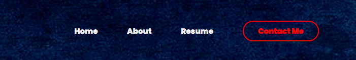
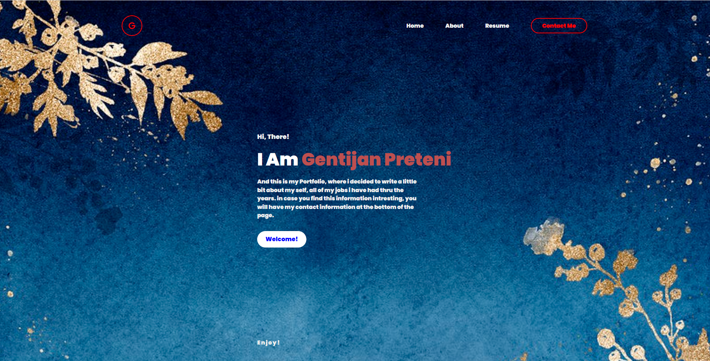
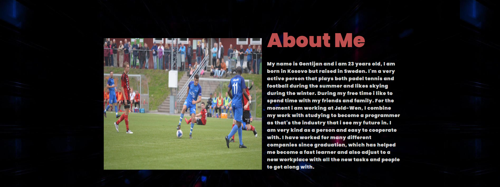
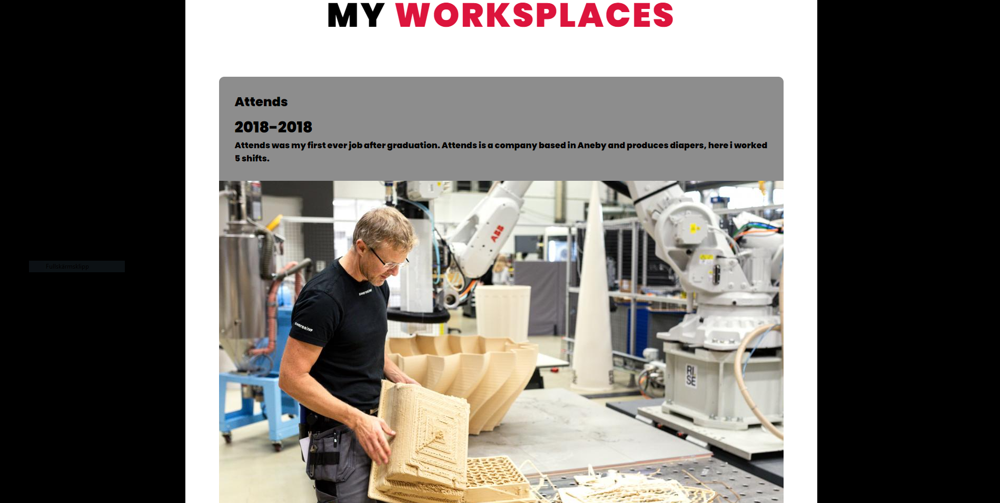
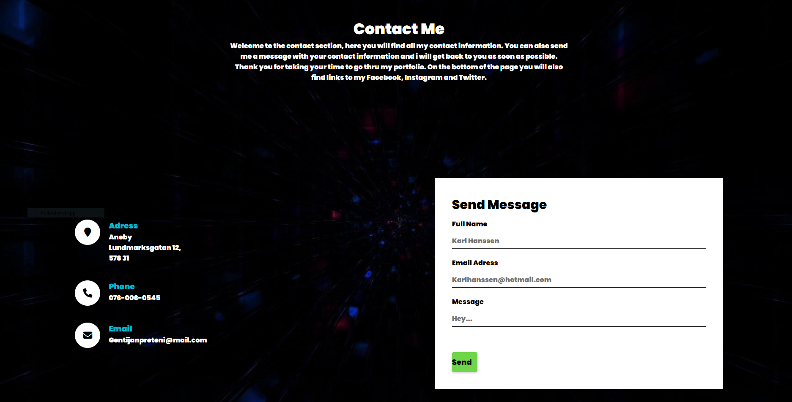
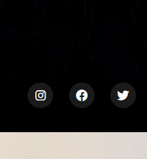
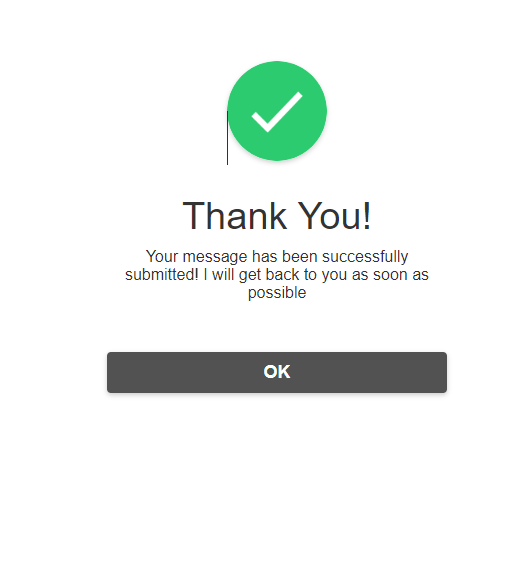

# AboutGentijan

Welcome! 
# Introduction
Gentijan is a small project that displays my knowledge of CSS and HTML as well as ability of designing unique and eye pleasing mobile first website

On this project i have tried my best to give the best information incase one day in the future i decides to search for a new job!
I have provided the readers with 4 diffrent sections
The first section is the home section, in the home section you will also find the navbar
The second section is the About me
the third is about my jobs i have had thru out my years
In The last section is the contact section and also the footer where i have stored my social media links

# Features
Below I will go over every feature of this website

## navbar

I have decided to create a simple navigation bar at the top, with 4 different buttons. All 4 buttons on navbar take the user to a specific section of the page

## Home page

The home page section is the heart of this website. I tried to make it beautiful as i could since it is the first thing a visitor will se 
On the Home page you will find 
- The navbar
- My Name 
- A text on what this website is about and what will be on it

## About Me 

The about me section is very simple, it includes only two different things
- A text were i describe my self
This text includes
- - My Age 
- - My Skills 
- - My hobbies
The section also includes a images of my self doing the thing i love most, which is playing football

## Resume 

This section is all about my jobs, i have had 4 different jobs and in this section i describe every singel one of them
- My work tasks
- how long i been working there
It also includes 4 images of a random person working,
i found this image on google by typing work picture 

## Contact

In this section you will find all my contact information you will need to reach out, it also includes a form where the user can send a fast massage with thier contact information. At the bottom of this page i have my footer where are have stored all my social links, such as Twitter, Facebook and Instagram
All the social media links will open up in a new tab

## Footer/social

The footer is where i have my links to my social media pages. there is 3 different links, Instagram, Facebook and twitter

## Form Submission 

After the form is submitted a new tab appears so the user knows that thier message was sent. If you click the OK button it will take you back to the Home page

# testing
- I tested that this page works in different browsers: Chrome, Firefox, Safari
- I Confirmed that this project is responsive, looks good and functions on all standard screen sizes using devtools device toolbar
- I confirmed that the navigation, home, about me, and contact are all readable and easy to understand
- i have confirmed that the form works: requires entries in every field, will only accept an email in the email field, and the submit button works

# validator testing
- HTML
- - No errors were returned when passing through the official W3C validator, some varnings but no errors
- CSS 
- - No errors were returned when passing through the official W3C validator
- accessibility 
- - I confirmed that the colors and fonts chosen are easy to read and accessible by running it through WAVE Evaluation Tool

# Deployment
- The site was deployed to GitHub pages. The steps to deploy are as follows
- - In the GitHub repository, navigate to the Settings tab
- - From the source section drop-down menu, select the Main Branch
- - Once the main branch has been selected, the page will be automatically refreshed with a detailed ribbon display to indicate the successful deployment
#### The live link can be found here - https://gentijan.github.io/AboutGentijan/

# Credits
## Content
- The home page was inspired by a youtube video made by https://www.youtube.com/watch?v=fOSpqwM_ZtQ&t=265s
- The contact section was inspired by a youtube video made by https://www.youtube.com/watch?v=gggB0Nq5vBk
## Media
- All the images was taken from google images
- The image on the about section was taken by typing Gentijan Preteni (My name) on google, images on main and contact by typing beautiful background images, image on resume section by typing factory image and on thankyou page by typing checkmark logo

